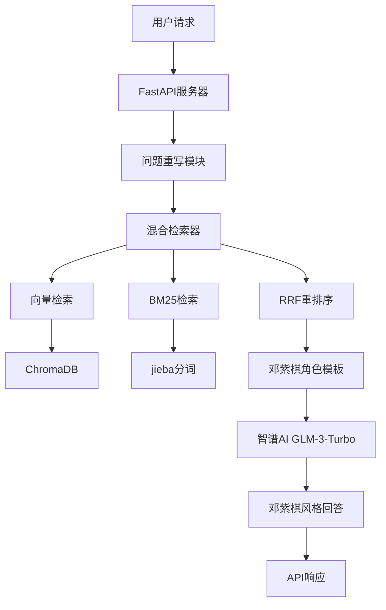

# 🎵 GEM Fan Club RAG - 邓紫棋AI聊天机器人

<div align="center">


一个基于RAG（检索增强生成）技术的邓紫棋粉丝俱乐部智能问答系统，能够以邓紫棋的语气和风格与粉丝进行自然对话。

[功能特性](#-功能特性) • [快速开始](#-快速开始) • [项目架构](#-项目架构) • [API文档](#-api文档) • [技术栈](#-技术栈) • [流程图](#-系统流程图)

</div>

---

## ✨ 功能特性

### 🎭 智能角色扮演
- **100%邓紫棋人设**：完全模拟邓紫棋的说话风格和语气
- **上下文感知**：支持多轮对话，理解对话历史
- **时间感知**：能够准确判断事件的时间线，使用正确的时态
- **情感表达**：根据问题内容调整回答的情感色彩

### 🧠 先进检索技术
- **自适应分块**：根据内容类型（生涯、演唱会、歌词）采用不同分块策略
- **混合检索**：结合向量检索和BM25关键词检索
- **RRF重排序**：使用科学算法优化检索结果
- **问题重写**：智能重写用户问题，提高检索准确性
- **中文分词**：使用jieba进行中文分词处理

### 📚 丰富知识库
- **生涯数据**：邓紫棋的成长历程和重要成就
- **演唱会信息**：巡演记录和演出详情
- **歌词库**：完整的歌曲歌词和创作背景
- **实时更新**：支持动态添加新的数据源

### 🚀 技术亮点
- **FastAPI**：高性能异步Web框架
- **ChromaDB**：高效的向量数据库
- **智谱AI**：先进的中文大语言模型
- **CORS支持**：完美支持前端集成
- **模块化设计**：易于扩展和维护

## 🚀 快速开始

### 环境要求
- Python 3.8+
- 智谱AI API Key
- 8GB+ 内存（推荐）

### 安装步骤

1. **克隆项目**
```bash
git clone https://github.com/your-username/gem_fan_club_rag.git
cd gem_fan_club_rag
```

2. **创建虚拟环境**
```bash
python -m venv venv
# Windows
venv\Scripts\activate
# Linux/Mac
source venv/bin/activate
```

3. **安装依赖**
```bash
pip install -r requirements.txt
```

4. **配置API密钥**
```bash
# 方法1：环境变量（推荐）
export ZHIPUAI_API_KEY="your_api_key_here"

# 方法2：直接修改config.py
# 编辑config.py文件，填入您的API密钥
```

5. **数据准备**
```bash
python load_data.py
```

6. **启动服务**
```bash
python rag_server.py
```

7. **访问服务**
- API服务：http://localhost:8000
- API文档：http://localhost:8000/docs
- 健康检查：http://localhost:8000/

### 首次运行说明
首次运行时会自动创建向量数据库，这个过程可能需要几分钟时间，请耐心等待。

## 🏗️ 项目架构

```
gem_fan_club_rag/
├── rag_server.py              # FastAPI服务器主程序
├── load_data.py               # 数据加载和预处理脚本
├── config.py                  # 配置文件
├── requirements.txt           # 项目依赖
├── gem_data/                  # 邓紫棋相关数据
│   ├── career/               # 生涯数据
│   ├── concert/              # 演唱会数据
│   └── lyrics/               # 歌词数据
├── rag_modules/              # RAG核心模块
│   ├── data_preparation.py   # 数据准备模块
│   ├── adaptive_splitter.py  # 自适应分块器
│   └── hybrid_retriever.py   # 混合检索器
├── chroma_db_zhipu/          # 向量数据库存储
├── scripts/                  # 辅助脚本
│   ├── get_lyrics.py         # 歌词获取脚本
│   └── word_to_txx.py        # 文档转换脚本
├── gem_rag_flowchart.md      # 系统流程图
└── README.md                 # 项目说明文档
```

### 核心模块说明

| 模块 | 功能 | 技术特点 |
|------|------|----------|
| **rag_server.py** | FastAPI服务器 | 异步处理、CORS支持、自动文档生成 |
| **data_preparation.py** | 数据预处理 | 智能分类、元数据增强、批量处理 |
| **adaptive_splitter.py** | 智能分块 | 类型感知、结构保持、优化检索 |
| **hybrid_retriever.py** | 混合检索 | RRF重排序、多模态检索、结果融合 |

## 🔧 核心模块

### 1. 数据准备模块 (`DataPreparationModule`)
- **自动加载**：支持多种文档格式（TXT、PDF、Word）
- **智能清洗**：文本格式标准化、特殊字符处理
- **元数据增强**：自动分类、路径解析、内容标注
- **批量处理**：高效处理大量文档

### 2. 自适应分块器 (`AdaptiveSplitter`)
- **生涯数据**：按时间线和重要事件分割，保持逻辑完整性
- **演唱会数据**：保持表格结构完整性，优化信息检索
- **歌词数据**：一首歌作为一个完整块，保持内容连贯性
- **智能合并**：自动处理过小的文本块

### 3. 混合检索器 (`HybridRetriever`)
- **向量检索**：语义相似度匹配，理解上下文含义
- **BM25检索**：关键词精确匹配，支持中文分词
- **RRF重排序**：科学融合两种检索结果，提高准确性
- **智能去重**：避免重复内容，优化用户体验

## 📡 API文档

### 聊天接口

#### 请求
```http
POST /chat_gem
Content-Type: application/json

{
    "question": "你最近在忙什么？",
    "history": [
        {"role": "user", "content": "你好"},
        {"role": "assistant", "content": "你好！很高兴见到你！"}
    ]
}
```

#### 响应
```json
{
    "answer": "我最近在准备新专辑呢！虽然很忙，但是看到你们这么支持我，我就充满了动力！"
}
```

### 健康检查接口

#### 请求
```http
GET /
```

#### 响应
```json
{
    "message": "欢迎使用 G.E.M. AI Chat API，服务运行正常！"
}
```

### 错误处理

| 状态码 | 错误类型 | 说明 |
|--------|----------|------|
| 400 | Bad Request | 请求参数错误 |
| 500 | Internal Server Error | 服务器内部错误 |

### 使用示例

#### Python
```python
import requests

url = "http://localhost:8000/chat_gem"
data = {
    "question": "你最喜欢哪首歌？",
    "history": []
}

response = requests.post(url, json=data)
result = response.json()
print(result["answer"])
```

#### JavaScript
```javascript
const response = await fetch('http://localhost:8000/chat_gem', {
    method: 'POST',
    headers: {
        'Content-Type': 'application/json',
    },
    body: JSON.stringify({
        question: "你最喜欢哪首歌？",
        history: []
    })
});

const result = await response.json();
console.log(result.answer);
```

## 🛠️ 技术栈

| 技术 | 版本 | 用途 | 特点 |
|------|------|------|------|
| **Python** | 3.8+ | 主要开发语言 | 简洁高效、生态丰富 |
| **FastAPI** | 0.116.1 | Web框架 | 高性能、自动文档生成 |
| **ChromaDB** | 1.0.20 | 向量数据库 | 轻量级、易部署 |
| **智谱AI** | GLM-3-Turbo | 大语言模型 | 中文优化、成本效益高 |
| **LangChain** | 0.3.27 | RAG框架 | 模块化、易于扩展 |
| **Pydantic** | 2.10.4 | 数据验证 | 类型安全、自动验证 |
| **jieba** | Latest | 中文分词 | 准确率高、速度快 |
| **uvicorn** | 0.35.0 | ASGI服务器 | 高性能、支持异步 |

### 技术架构图



## 🎯 使用场景

- **粉丝互动**：为邓紫棋粉丝提供智能问答服务
- **信息查询**：快速查找邓紫棋的相关信息
- **对话陪伴**：模拟邓紫棋与粉丝的日常对话
- **学习研究**：RAG技术的学习和实验
- **内容创作**：为音乐相关创作提供灵感
- **教育应用**：音乐教育和文化传播

## 📊 系统流程图

完整的系统流程图请查看 [gem_rag_flowchart.md](gem_rag_flowchart.md)

### 核心流程概述

1. **数据准备**：加载和清洗邓紫棋相关数据
2. **智能分块**：根据内容类型采用不同分块策略
3. **向量化存储**：使用智谱AI进行向量化并存储到ChromaDB
4. **混合检索**：结合向量检索和BM25关键词检索
5. **问题重写**：智能重写用户问题，提高检索准确性
6. **角色扮演**：使用邓紫棋角色模板生成回答
7. **API响应**：通过FastAPI返回结果

## 🤝 贡献指南

欢迎提交Issue和Pull Request！

### 如何贡献

1. **Fork本项目**
2. **创建特性分支** (`git checkout -b feature/AmazingFeature`)
3. **提交更改** (`git commit -m 'Add some AmazingFeature'`)
4. **推送到分支** (`git push origin feature/AmazingFeature`)
5. **开启Pull Request**

### 贡献类型

- 🐛 Bug修复
- ✨ 新功能开发
- 📚 文档改进
- 🎨 界面优化
- ⚡ 性能提升

### 开发规范

- 遵循PEP 8代码风格
- 添加必要的注释和文档
- 确保代码通过测试
- 更新相关文档

## 📄 许可证

本项目采用 MIT 许可证 - 查看 [LICENSE](LICENSE) 文件了解详情

## 🙏 致谢

- [智谱AI](https://www.zhipuai.cn/) - 提供强大的中文大语言模型
- [LangChain](https://langchain.com/) - 优秀的RAG框架
- [ChromaDB](https://www.trychroma.com/) - 高效的向量数据库
- [FastAPI](https://fastapi.tiangolo.com/) - 现代化的Python Web框架
- [jieba](https://github.com/fxsjy/jieba) - 优秀的中文分词工具

## 📞 联系我们

- 项目地址：[GitHub Repository](https://github.com/your-username/gem_fan_club_rag)
- 问题反馈：[Issues](https://github.com/your-username/gem_fan_club_rag/issues)
- 邮箱：your-email@example.com

---

<div align="center">

**⭐ 如果这个项目对您有帮助，请给个Star支持一下！**

Made with ❤️ by GEM Fan Club

</div>

