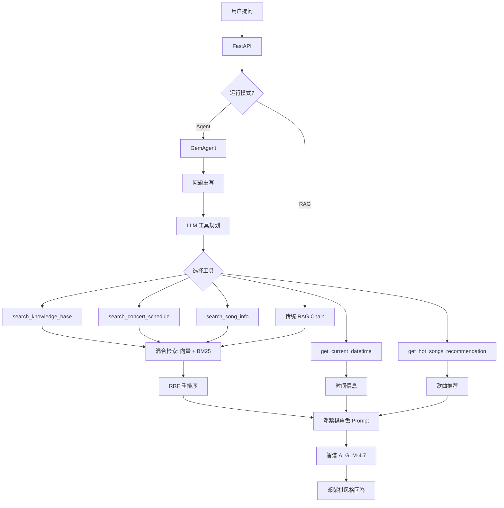

# 🤖 GEM Fan Club RAG - 邓紫棋 AI 聊天机器人

<div align="center">


基于 **RAG + Tool-Augmented Agent** 的邓紫棋粉丝智能问答系统，能够以邓紫棋的语气与粉丝自然对话。

[功能特性](#-功能特性) · [快速开始](#-快速开始) · [架构设计](#-架构设计) · [API 文档](#-api-文档) · [版本历史](#-版本历史)

</div>

---

## ✨ 功能特性

### 🎭 智能角色扮演
- **100% 邓紫棋人设**：完全模拟说话风格和语气
- **多轮对话**：上下文感知，对话历史自动截断（可配置轮数）
- **时间感知**：LLM 自主调用时间工具，准确判断事件时间线
- **情感表达**：根据话题调整回答的情感色彩

### 🧠 v2.0 Tool-Augmented Agent（当前版本）

LLM 不再依赖硬编码路由，而是**自主决策**调用哪些工具：

| 工具名称                       | 功能                                   | 文件                 |
| ------------------------------ | -------------------------------------- | -------------------- |
| `search_knowledge_base`        | 通用知识库检索（生涯、个人信息、奖项） | `knowledge_tools.py` |
| `search_concert_schedule`      | 演唱会日程检索（带时间排序）           | `knowledge_tools.py` |
| `search_song_info`             | 歌曲信息检索（歌词、创作背景）         | `knowledge_tools.py` |
| `get_current_datetime`         | 获取当前时间（含星期几）               | `time_tools.py`      |
| `get_hot_songs_recommendation` | 热门歌曲推荐（支持偏好筛选）           | `recommend_tools.py` |

### 🔍 先进检索技术
- **自适应分块**：生涯按时间线、演唱会保持表格结构、歌词整首为一块
- **混合检索**：向量检索 (ChromaDB) + BM25 关键词检索 (jieba 分词)
- **RRF 重排序**：Reciprocal Rank Fusion 科学融合检索结果
- **问题重写**：LLM 智能重写用户问题，提高检索准确性

### 📚 知识库
- **生涯数据** — 成长历程、重要成就
- **演唱会信息** — 巡演记录、演出详情 (I AM Gloria 等)
- **歌词库** — 完整歌词、创作背景
- **热门歌曲** — hot_song.json 推荐数据

## 🛠️ 技术栈

| 技术        | 版本    | 用途                           |
| ----------- | ------- | ------------------------------ |
| Python      | 3.8+    | 主语言                         |
| FastAPI     | 0.116.1 | 异步 Web 框架                  |
| ChromaDB    | 1.0.20  | 向量数据库                     |
| 智谱 AI     | GLM-4.7 | 大语言模型（对话 + Embedding） |
| LangChain   | 0.3.27  | RAG 编排框架                   |
| jieba       | Latest  | 中文分词 (BM25)                |
| uvicorn     | 0.35.0  | ASGI 服务器                    |
| Pydantic    | 2.10.4  | 数据验证                       |
| python-docx | 1.2.0   | Word 文档解析                  |

## 🚀 快速开始

### 环境要求

- Python 3.8+
- 智谱 AI API Key
- 8GB+ 内存（推荐）

### 安装与运行

```bash
# 克隆项目
git clone https://github.com/Reyotsed/GEM_FAN_CLUB_RAG.git
cd GEM_FAN_CLUB_RAG

# 创建虚拟环境
python -m venv venv
source venv/bin/activate  # Linux/Mac
# venv\Scripts\activate   # Windows

# 安装依赖
pip install -r requirements.txt

# 配置 API 密钥（任选一种）
export ZHIPUAI_API_KEY="your_api_key"    # 环境变量
# 或创建 .env 文件: ZHIPUAI_API_KEY=your_api_key

# 数据准备（首次运行，创建向量数据库）
python load_data.py

# 启动服务
python rag_server.py                 # 默认 Agent 模式
python rag_server.py --mode rag      # 传统 RAG 模式
```

### 运行模式

| 模式              | 启动方式                                 | 说明                 |
| ----------------- | ---------------------------------------- | -------------------- |
| **Agent**（默认） | `python rag_server.py` 或 `--mode agent` | LLM 自主决策调用工具 |
| **RAG**           | `--mode rag` 或 `RUNTIME_MODE=rag`       | 传统检索增强生成     |

### 访问地址

- API 服务: `http://localhost:8000`
- Swagger 文档: `http://localhost:8000/docs`
- 健康检查: `http://localhost:8000/`

## 🏗️ 架构设计

```
GEM_FAN_CLUB_RAG/
├── rag_server.py                   # FastAPI 主程序（双模式运行）
├── config.py                       # 全局配置（环境变量驱动）
├── load_data.py                    # 数据加载 & 向量化入口
├── requirements.txt                # 依赖清单
├── hot_song.json                   # 热门歌曲推荐数据
│
├── agent/                          # v2.0 Agent 模块
│   ├── __init__.py
│   ├── gem_agent.py                # Agent 编排核心
│   │   └── 问题重写 → 工具规划(LLM) → 工具执行 → 回答生成
│   └── tools/
│       ├── __init__.py
│       ├── tool_registry.py        # 工具注册中心 + ToolResult
│       ├── knowledge_tools.py      # 知识检索工具 ×3
│       ├── time_tools.py           # 时间工具
│       └── recommend_tools.py      # 推荐工具
│
├── rag_modules/                    # RAG 核心模块
│   ├── data_preparation.py         # 数据清洗、元数据增强
│   ├── adaptive_splitter.py        # 自适应分块器
│   ├── hybrid_retriever.py         # 混合检索 + RRF 重排序
│   └── prompts.py                  # Prompt 模板
│
├── gem_data/                       # 邓紫棋知识库
│   ├── career/gem.txt              # 生涯数据
│   ├── concert/I AM Gloria.json    # 演唱会数据
│   └── lyrics/*.txt                # 歌词库
│
└── scripts/
    └── get_lyrics.py               # 歌词抓取脚本
```

### 系统流程


```mermaid
graph TB
    A[用户提问] --> B[FastAPI]
    B --> C{运行模式?}
    C -->|Agent| D[GemAgent]
    C -->|RAG| E[传统 RAG Chain]
    D --> F[问题重写]
    F --> G[LLM 工具规划]
    G --> H{选择工具}
    H --> I[search_knowledge_base]
    H --> J[search_concert_schedule]
    H --> K[search_song_info]
    H --> L[get_current_datetime]
    H --> M[get_hot_songs_recommendation]
    I & J & K --> N[混合检索: 向量 + BM25]
    N --> O[RRF 重排序]
    L --> P[时间信息]
    M --> Q[歌曲推荐]
    O & P & Q --> R[邓紫棋角色 Prompt]
    R --> S[智谱 AI GLM-4.7]
    S --> T[邓紫棋风格回答]
    E --> N
```

## 📡 API 文档

### POST `/chat_gem` — 聊天

```json
// Request
{
    "question": "你最近在忙什么？",
    "history": [
        {"role": "user", "content": "你好"},
        {"role": "assistant", "content": "你好！很高兴见到你！"}
    ]
}

// Response
{
    "answer": "我最近在准备新专辑呢！虽然很忙，但看到你们支持我就充满动力！"
}
```

### GET `/` — 健康检查

```json
{
    "message": "欢迎使用 G.E.M. AI Chat API，服务运行正常！"
}
```

## ⚙️ 配置项

所有配置均通过环境变量或 `.env` 文件管理：

| 配置项                         | 默认值             | 说明                             |
| ------------------------------ | ------------------ | -------------------------------- |
| `ZHIPUAI_API_KEY`              | （必填）           | 智谱 AI 密钥                     |
| `ZHIPUAI_MODEL`                | `glm-4.7`          | 对话模型                         |
| `ZHIPUAI_EMBEDDING_MODEL`      | `embedding-3`      | 向量化模型                       |
| `ZHIPUAI_TEMPERATURE`          | `0.8`              | 生成温度                         |
| `ZHIPUAI_TIMEOUT`              | `120`              | API 超时（秒）                   |
| `VECTOR_RETRIEVER_K`           | `10`               | 向量检索 Top-K                   |
| `BM25_RETRIEVER_K`             | `10`               | BM25 检索 Top-K                  |
| `HYBRID_RETRIEVER_NUM_RESULTS` | `5`                | 混合检索最终结果数               |
| `HISTORY_MAX_TURNS`            | `5`                | 对话历史最大轮数                 |
| `AGENT_PLANNING_TEMPERATURE`   | `0.1`              | Agent 工具规划温度（低温更确定） |
| `AGENT_MAX_TOOL_CALLS`         | `3`                | 单轮最大工具调用数               |
| `HOST` / `PORT`                | `0.0.0.0` / `8000` | 服务地址                         |

## 📋 版本历史

| 版本       | 日期       | 核心变更                                   |
| ---------- | ---------- | ------------------------------------------ |
| **v2.0.0** | 2026-03-03 | Tool-Augmented Agent，LLM 自主决策工具调用 |
| **v1.1.0** | —          | 质量改进：限流、去重、K 值调优、日志优化   |
| **v1.0.0** | —          | 初始版本：混合检索 + RRF + 角色扮演        |

> 详细变更日志见 [CHANGELOG.md](CHANGELOG.md)

### 未来规划

- **v2.1** — 工具缓存、专辑/奖项查询工具
- **v3.0** — ReAct 多步推理 + SSE 流式响应
- **v4.0** — Multi-Agent + 微博爬虫 + 多媒体

## 🔗 关联项目

| 项目                 | 说明                 | 仓库                                                   |
| -------------------- | -------------------- | ------------------------------------------------------ |
| **GEM-FAN-CLUB-VUE** | Vue 3 前端应用       | [GitHub](https://github.com/Reyotsed/GEM-FAN-CLUB-VUE) |
| **GEM-FAN-CLUB-WEB** | Spring Boot 后端 API | [GitHub](https://github.com/Reyotsed/GEM-FAN-CLUB-WEB) |

## 🙏 致谢

- [智谱 AI](https://www.zhipuai.cn/) — 中文大语言模型
- [LangChain](https://langchain.com/) — RAG 框架
- [ChromaDB](https://www.trychroma.com/) — 向量数据库
- [FastAPI](https://fastapi.tiangolo.com/) — Web 框架

## 📄 许可证

MIT License

---

<div align="center">

⭐ **如果这个项目对你有帮助，请给一个 Star！**

Made with ❤️ for G.E.M. fans

</div>
