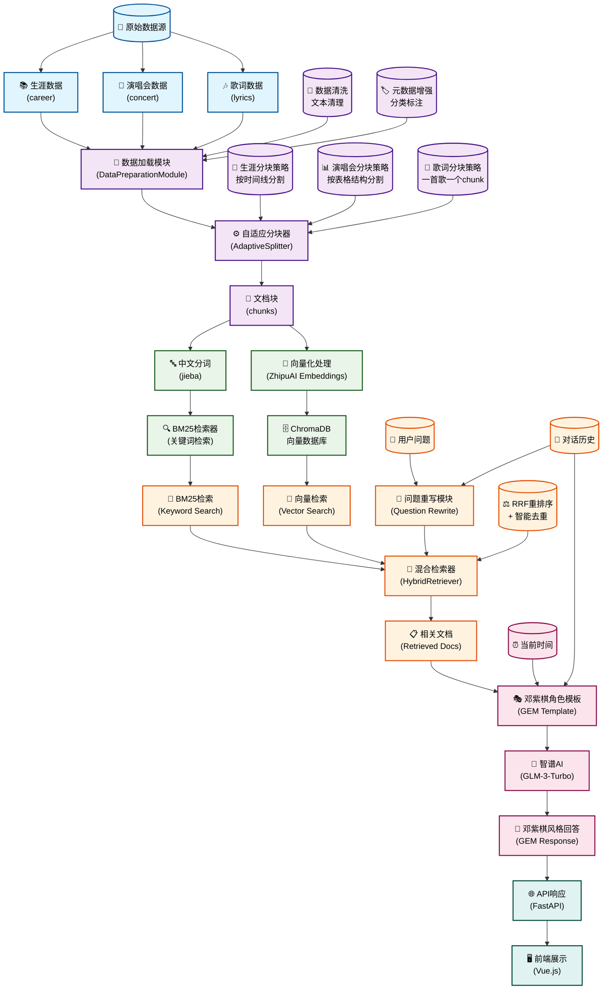

# 🎵 GEM Fan Club RAG 系统流程图

## 🎯 系统流程详解

### 1. 📊 数据源阶段
- **生涯数据**：邓紫棋的成长历程和重要成就
- **演唱会数据**：巡演记录和演出详情  
- **歌词数据**：完整的歌曲歌词和创作背景

### 2. 🔧 数据预处理阶段
- **数据加载**：`DataPreparationModule`统一加载所有数据
- **数据清洗**：清理文本格式，移除特殊字符
- **元数据增强**：根据文件路径自动分类和标注

### 3. ⚙️ 智能分块阶段
- **自适应分块器**：根据文档类型采用不同策略
  - **生涯数据**：按时间线和重要事件分割
  - **演唱会数据**：保持表格结构完整性
  - **歌词数据**：一首歌作为一个完整块

### 4. 🧮 向量化存储阶段
- **中文分词**：使用jieba进行中文分词处理
- **向量化**：使用智谱AI的embedding模型
- **存储**：保存到ChromaDB向量数据库

### 5. 🔍 混合检索阶段
- **问题重写**：将用户问题重写为更完整的查询
- **向量检索**：语义相似度匹配
- **BM25检索**：关键词精确匹配
- **RRF重排序**：科学融合两种检索结果

### 6. 🎭 生成回答阶段
- **角色模板**：邓紫棋的角色扮演模板
- **上下文构建**：结合检索文档、对话历史、当前时间
- **AI生成**：通过智谱AI生成符合邓紫棋风格的回答

### 7. 🌐 服务接口阶段
- **API服务**：FastAPI提供RESTful接口
- **前端展示**：Vue.js前端应用展示结果

## 🚀 技术亮点

- **🎯 自适应分块**：根据内容类型智能选择分块策略
- **🔀 混合检索**：结合语义检索和关键词检索
- **🎭 角色扮演**：完全模拟邓紫棋的说话风格
- **🧠 上下文感知**：支持对话历史和问题重写
- **⚖️ 科学重排序**：使用RRF算法优化检索结果
